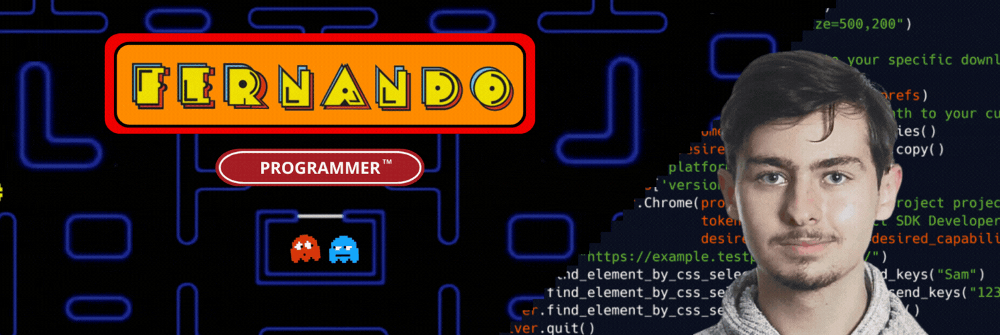
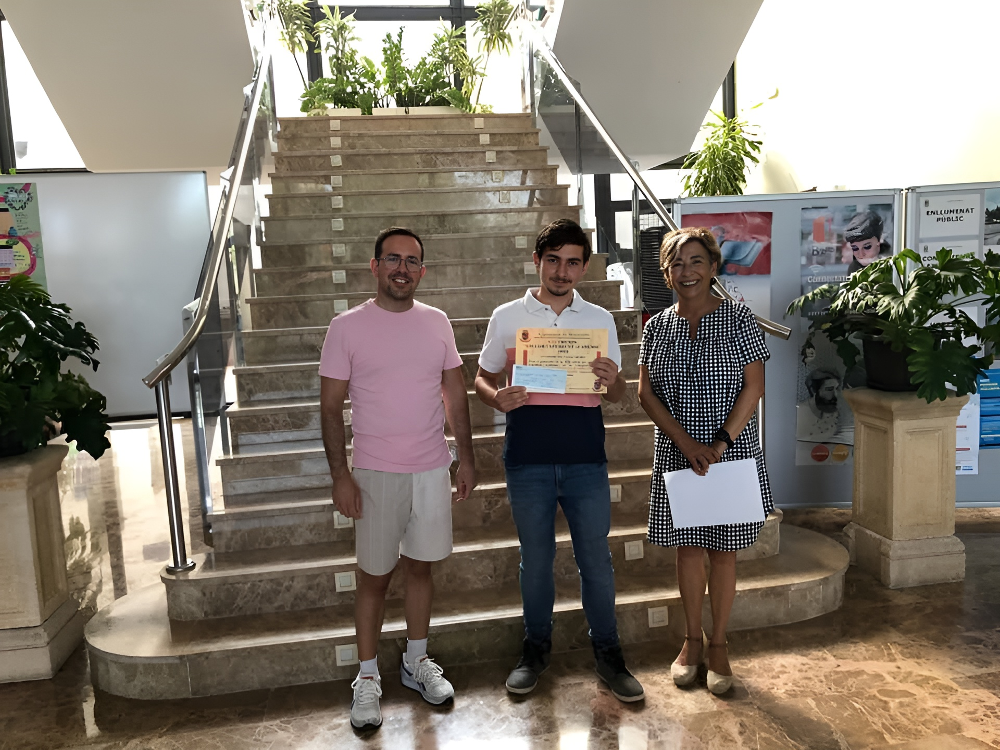

  

  

## 🧭 About me

<a target="_blank" align="center">
  
</a>

 

- Cross-platform application developer 💻📱🎮

- Passionate about technology 🤖​❤️‍👨🏻‍💻​

- Learning B1 English :uk:​ and A2 of German :de:

- Learning Tensorflow 🦾​🔥
  
- Best academic record of Benirredrà 2022 🏆

 

## 👨‍💻 Languages

  

## 🛠 Technologies

  
  
  

## 📈 Statistics

<!--- stats & Trophy (start) -->

  <!--- stats (start) -->
<table align="center">
<tr border="none">
<td width="50%" align="center">
  
  
    
   
</td>

<td width="50%" align="center">

  
  
  </td>
</tr>
</table>
<!--- stats (end) -->

<!--- trophy (start) -->

  

<!--- trophy (start) -->

        
<!--- stats (end) -->

